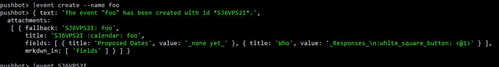

# Hubot Shellish Adapter

Developing Hubot scripts intended for use with the Slack adapter is a bit of a pain, because the default Shell adapter prints any complex responses as the thoroughly unhelpful `[object Object]`. If you wish to preview these responses locally, install and use the Shellish adapter instead to see a `util.inspect()` dump of any complex responses.



## Install it

Install this package from npm:

```sh
$ npm install hubot-shellish
```

## Use it

Append `--adapter shellish` to your command-line arguments:

```sh
$ ./node_modules/.bin/hubot --adapter shellish
```
